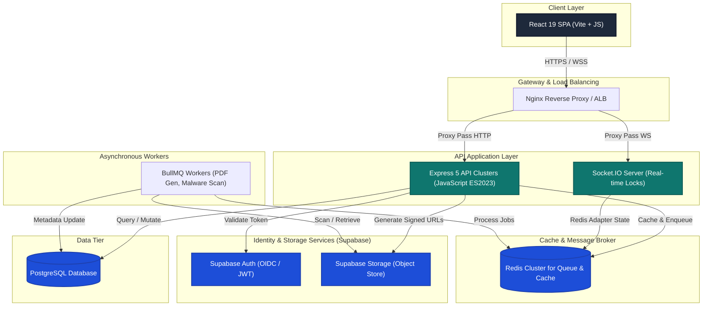
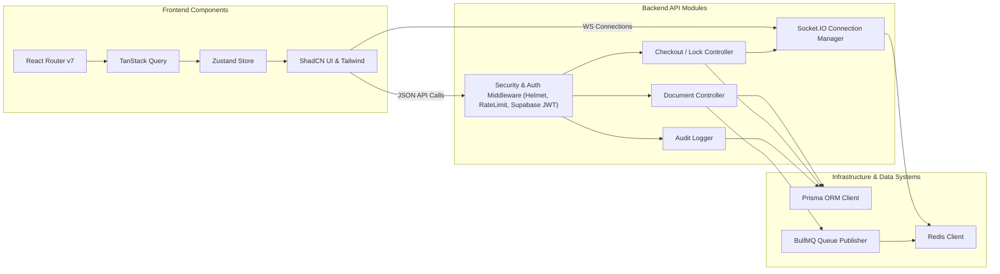
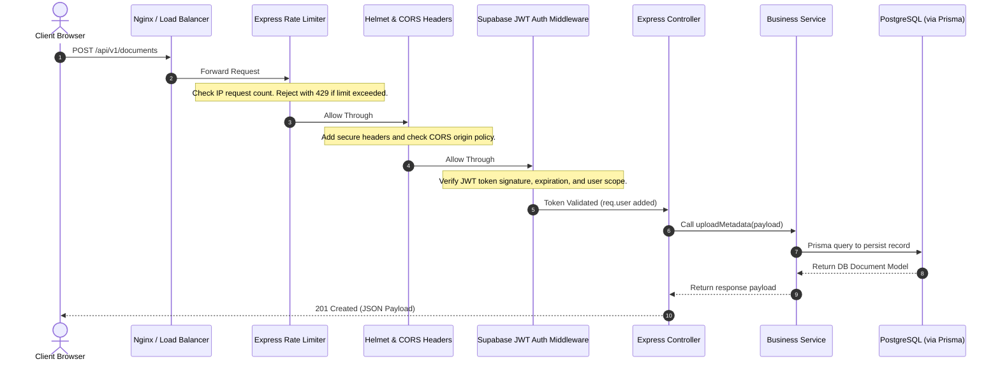
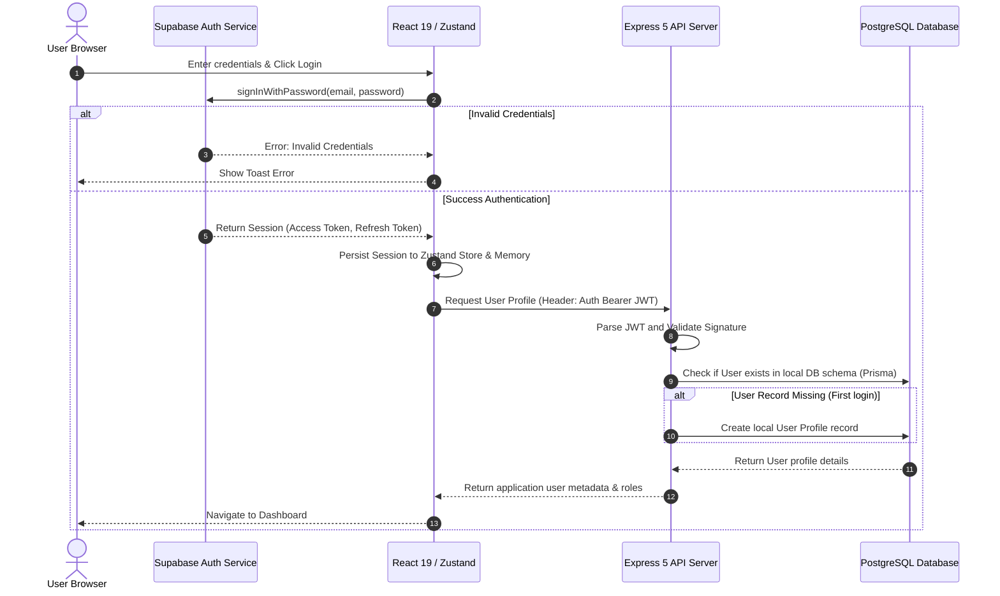
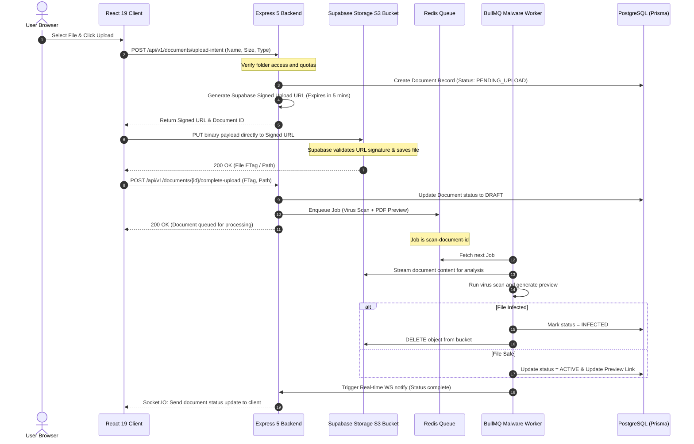
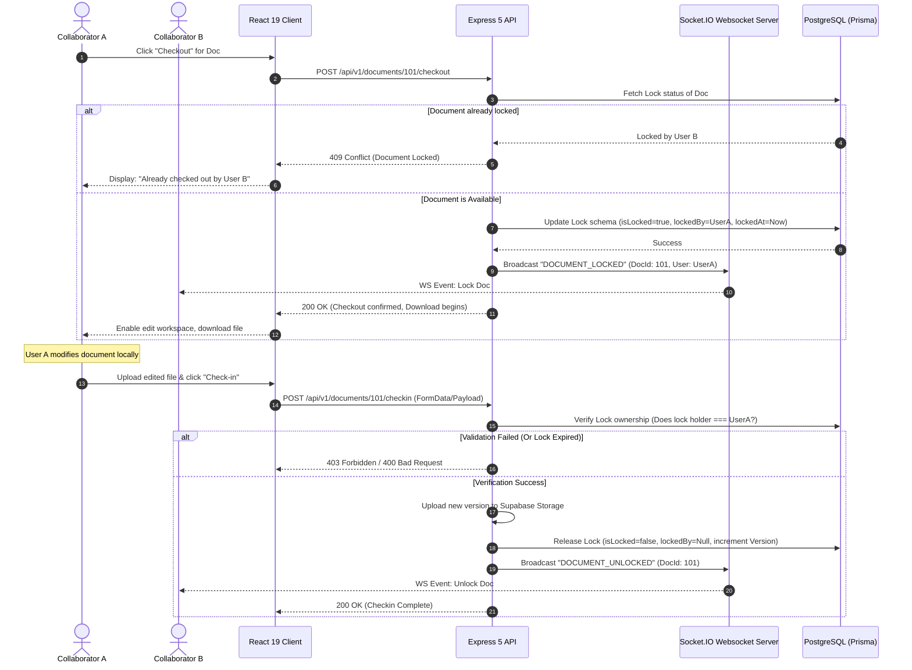
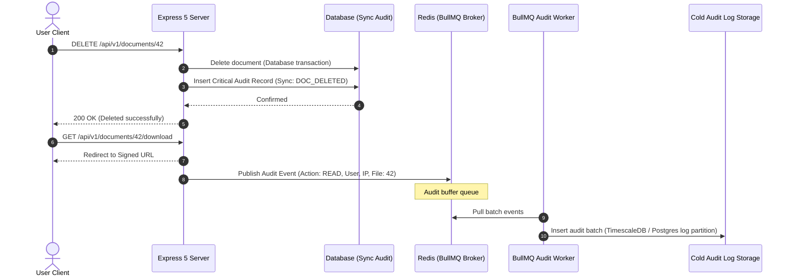
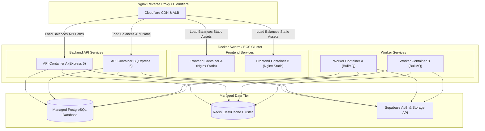

# High-Level Design (HLD)
## MITCON-CREDENTIA Ledger (MC-Ledger)
**Document Version:** 1.1.0  
**Author:** Principal Solution Architect  
**Date:** June 29, 2026  

---

## 1. Executive Summary & Design Goals
The **MITCON-CREDENTIA Ledger (MC-Ledger)** is an enterprise-grade document storage, management, and sharing platform. The system is designed to provide secure, authenticated, and audited access to digital files and credentials with strict concurrency control (Checkout/Return mechanism).

### Key Architectural Pillars:
* **High Availability & Scalability:** Stateless application nodes with horizontal scaling.
* **Security & Compliance:** Strict access controls, encrypted transit and rest, rate limiting, and immutable audit logs.
* **Real-time Synchronization:** Dynamic UI updates for file lock/unlock states via WebSockets.
* **Resiliency:** Asynchronous processing of heavy operations (virus scanning, conversions) using message queues.

---

## 2. Overall System Architecture
The system follows a modern **three-tier architecture** with decoupled layers for presentation, API gateway & business logic, and asynchronous job processing, backed by managed services.



---

## 3. Component Diagram
Detailed view of system modules, dependencies, and internal interfaces.



---

## 4. High-Level Module Breakdown

### 4.1. Authentication & Authorization Module
* **Supabase Auth Integration:** Utilizes Supabase Client SDK on the frontend for login, registration, password resets, and session renewal. JWT access tokens are sent in the HTTP `Authorization: Bearer <JWT>` header.
* **Express JWT Verification Middleware:** Decodes and validates JWTs using Supabase's public keys. It extracts claims (e.g., `uid`, `role`, `email`) and attaches the user object to the Express request scope (`req.user`).
* **Role-Based Access Control (RBAC):** Middleware policies enforce access checks (e.g., `admin`, `uploader`, `viewer`) before routing requests to controllers.

### 4.2. Document Management Module
* **Metadata CRUD:** Handles directory navigation hierarchy, document categories, descriptions, tags, and version tracking. Powered by **Prisma** to query PostgreSQL.
* **Storage Coordinator:** Interface wrapper for **Supabase Storage**. Standardizes folder hierarchies within the S3-compatible buckets and regulates upload/download presigned URLs.

### 4.3. Concurrency Control (Checkout & Return) Module
* **Lock Manager:** Implements cooperative file locking. Restricts read-write interactions to a single user when editing a file.
* **WebSocket Integration:** Syncs file locking state updates across all connected clients instantly. Uses **Socket.IO** to join document-specific rooms and broadcast state changes (Lock, Unlock, Force Unlock).

### 4.4. Audit Logging Module
* **Compliance Auditor:** Captures structured activity logs containing timestamps, IP addresses, resource identifiers, agent scopes, and precise action schemas (e.g., `DOCUMENT_UPLOADED`, `DOCUMENT_CHECKED_OUT`, `VERSION_ROLLED_BACK`).
* **Dual-Channel Processing:** Writes transactional changes (like Checkouts) synchronously to the main DB, while offloading high-volume events (like File Downloads) asynchronously to Redis/BullMQ to keep requests responsive.

### 4.5. Background Processing & Workers
* **BullMQ Dashboard & Producers:** Dispatches background jobs to Redis.
* **Malware/Virus Scanner:** Pulls newly uploaded drafts, scans using ClamAV/VirusTotal APIs, and updates file validation states in PostgreSQL.
* **Preview Generator:** Generates low-resolution web previews (e.g., converting PDFs to PNGs, rendering text document thumbnails).

---

## 5. Request & Security Flow
This flow details how standard API requests transit from the client to the database through the Express 5 middleware pipeline.



---

## 6. Detailed Workflows

### 6.1. Authentication Flow
Supabase Auth manages user credentials and token issues, while our custom Express API authorizes application resources.



### 6.2. Direct-to-Storage Document Upload Flow
To optimize server bandwidth, the client uploads documents directly to Supabase Storage using a secure, backend-signed URL.



### 6.3. Checkout & Return Workflow
Strict document check-out mechanism guarantees that file modification conflicts are avoided.



### 6.4. Audit Logging Flow
Ensures transactional logging of crucial operations for compliance.



---

## 7. Infrastructure & Background Job Architecture
The background processing pipeline is powered by **BullMQ** running over **Redis**. This decouples time-consuming IO/CPU processes from the main Express HTTP server thread pool.

```
                  ┌──────────────────────────────────────────────┐
                  │              Express 5 Backend               │
                  └──────┬────────────────────────────────┬──────┘
                         │                                │
                 (Enqueue PDF Jobs)               (Enqueue Scan Jobs)
                         │                                │
                         ▼                                ▼
       ┌──────────────────────────────────────────────────────────────────┐
       │                          Redis Server                            │
       │    ┌──────────────────────────────┐┌──────────────────────────┐  │
       │    │      pdf-conversion-q        ││      virus-scan-q        │  │
       │    └──────────────────────────────┘└──────────────────────────┘  │
       └─────────────────▲────────────────────────────────▲───────────────┘
                         │                                │
                  (Worker Polls)                   (Worker Polls)
                         │                                │
       ┌─────────────────┴─────────────┐  ┌───────────────┴──────────────┐
       │   BullMQ Worker Node #1       │  │    BullMQ Worker Node #2     │
       │   (PDF/Image Generation)      │  │     (ClamAV/Virus Scanner)   │
       └───────────────────────────────┘  └──────────────────────────────┘
```

### Queue Definitions & Configurations:
1. **`virus-scan-queue`:**
   * **Job:** Run virus scanner validation on raw uploads.
   * **Concurrency:** 5 concurrent processes per worker.
   * **Retries:** Retry 3 times with exponential backoff (`delay: 5000ms`, `backoff: 'exponential'`).
2. **`pdf-conversion-queue`:**
   * **Job:** Extract textual schema, execute document rendering, and output JPG/PNG preview.
   * **Concurrency:** 2 concurrent processes per worker (CPU intensive).
3. **`lock-cleanup-queue`:**
   * **Job:** Cron-like schedule checker (every 10 minutes) that scans for active locks older than 24 hours and force-releases them.

---

## 8. Deployment Architecture
We leverage containerization via **Docker** to ensure local development environments match production builds exactly.



---

## 9. Security Architecture

### 9.1. Express Security Headers (Helmet)
```javascript
import helmet from 'helmet';

app.use(helmet({
  contentSecurityPolicy: {
    directives: {
      defaultSrc: ["'self'"],
      scriptSrc: ["'self'", "'unsafe-inline'"],
      styleSrc: ["'self'", "'unsafe-inline'", "https://fonts.googleapis.com"],
      connectSrc: ["'self'", "https://*.supabase.co", "wss://*.supabase.co", "wss://api.mitcon-fss.com"],
      imgSrc: ["'self'", "data:", "https://*.supabase.co"],
      objectSrc: ["'none'"]
    }
  },
  crossOriginEmbedderPolicy: true,
  referrerPolicy: { policy: 'same-origin' }
}));
```

### 9.2. Rate Limiting Strategy
We implement rate limiting at two distinct layers:
1. **Reverse Proxy (Nginx / Cloudflare):** Prevents DDoS attacks at the transport level.
2. **API Application Level (Express Rate Limiter):** Enforces user-specific quotas based on authenticated JWTs and Client IP addresses.

| Path Pattern | Rate Limit Policy | Window Size | Purpose |
| :--- | :--- | :--- | :--- |
| `/api/v1/auth/*` | 10 requests | 15 Minutes | Mitigate brute force logins |
| `/api/v1/documents/upload-intent` | 30 requests | 1 Hour | Prevent API upload spam |
| `/api/v1/*` (General API) | 300 requests | 15 Minutes | Default application quota |

### 9.3. Data Protection Summary
* **In-Transit Encryption:** All communication requires TLS 1.3. WebSockets run on secure TLS layers (`wss://`).
* **At-Rest Encryption:** 
  * PostgreSQL databases utilize transparent data encryption (TDE) via AWS KMS or equivalent provider keys.
  * Supabase Storage buckets run under AWS S3 Server-Side Encryption (SSE-S3).

---

## 10. Database Schema (Prisma Representation)
This database layout models the documents, version tracking, user permissions, locking schemas, and audit logs.

```prisma
datasource db {
  provider = "postgresql"
  url      = env("DATABASE_URL")
}

generator client {
  provider = "prisma-client-js"
}

enum DocumentStatus {
  PENDING_UPLOAD
  DRAFT
  ACTIVE
  INFECTED
  ARCHIVED
}

enum AuditAction {
  LOGIN
  DOCUMENT_UPLOADED
  DOCUMENT_DOWNLOADED
  DOCUMENT_CHECKED_OUT
  DOCUMENT_CHECKED_IN
  LOCK_FORCE_RELEASED
  DOCUMENT_DELETED
}

model User {
  id             String         @id // Matches Supabase Auth UUID
  email          String         @unique
  role           String         @default("VIEWER") // VIEWER, UPLOADER, ADMIN
  createdAt      DateTime       @default(now()) @map("created_at")
  updatedAt      DateTime       @updatedAt @map("updated_at")
  documentsOwned Document[]     @relation("DocOwner")
  checkedOutDocs Document[]     @relation("DocLocks")
  auditLogs      AuditLog[]

  @@map("users")
}

model Document {
  id            String         @id @default(uuid())
  name          String
  filePath      String         @map("file_path") // Path inside Supabase Storage Bucket
  fileSize      Int            @map("file_size")
  mimeType      String         @map("mime_type")
  status        DocumentStatus @default(PENDING_UPLOAD)
  version       Int            @default(1)
  ownerId       String         @map("owner_id")
  owner         User           @relation("DocOwner", fields: [ownerId], references: [id])
  
  // Checkout Lock Fields
  isLocked      Boolean        @default(false) @map("is_locked")
  lockedById    String?        @map("locked_by_id")
  lockedBy      User?          @relation("DocLocks", fields: [lockedById], references: [id])
  lockedAt      DateTime?      @map("locked_at")
  
  createdAt     DateTime       @default(now()) @map("created_at")
  updatedAt     DateTime       @updatedAt @map("updated_at")
  versions      FileVersion[]
  auditLogs     AuditLog[]

  @@index([ownerId])
  @@index([lockedById])
  @@map("documents")
}

model FileVersion {
  id         String   @id @default(uuid())
  documentId String   @map("document_id")
  document   Document @relation(fields: [documentId], references: [id], onDelete: Cascade)
  version    Int
  filePath   String   @map("file_path") // Previous Supabase Storage Bucket Key path
  changeLog  String?  @map("change_log")
  createdBy  String   @map("created_by") // User ID who created this specific revision
  createdAt  DateTime @default(now()) @map("created_at")

  @@unique([documentId, version])
  @@map("file_versions")
}

model AuditLog {
  id         String      @id @default(uuid())
  action     AuditAction
  userId     String?     @map("user_id")
  user       User?       @relation(fields: [userId], references: [id], onDelete: SetNull)
  documentId String?     @map("document_id")
  document   Document?   @relation(fields: [documentId], references: [id], onDelete: SetNull)
  ipAddress  String      @map("ip_address")
  userAgent  String      @map("user_agent")
  payload    Json?       // Dynamic change metadata
  createdAt  DateTime    @default(now()) @map("created_at")

  @@index([userId])
  @@index([documentId])
  @@index([createdAt])
  @@map("audit_logs")
}
```

---

## 11. Scalability Considerations

### 11.1. Stateless Backend Auto-scaling
The Express 5 servers store zero local state. User authorization is validated token-by-token using Supabase's cryptographically signed JWT keys. As a result, requests can be balanced across standard round-robin DNS or container groups effortlessly.

### 11.2. WebSocket Horizontal Scaling via Redis Adapter
By default, Socket.IO tracks connections in local server memory. To support auto-scaled backends:
* We deploy the `@socket.io/redis-adapter` module.
* Event broadcasts (e.g., `DOCUMENT_LOCKED`) are published through Redis Pub/Sub channels to all instances. Every API instance can then notify its local connected clients.

### 11.3. Database Query & Connection Optimizations
* **PgBouncer Connection Pooling:** Standard Prisma setups open direct database channels. We route SQL requests through PgBouncer/Supabase Connection Poolers in transaction mode to restrict open connections to the active limit.
* **Redis Caching:** Relational document lists, permissions, and settings configurations are cached in Redis with dynamic invalidation (Cache Aside Pattern) to reduce PG master read stresses.

---

## 12. Folder Structure Overview
The project layout segregates Frontend (React 19 SPA) and Backend (Express 5 Server) inside a clean, scalable monorepo or dual-repo directory layout.

```
mitcon-credentia-ledger/
├── docker-compose.yml
├── README.md
│
├── frontend/                     # React 19 Frontend Web Client (JavaScript ESM)
│   ├── package.json
│   ├── vite.config.js
│   ├── tailwind.config.js
│   ├── postcss.config.js
│   ├── public/
│   └── src/
│       ├── main.jsx
│       ├── App.jsx
│       ├── index.css             # Main styling system & design tokens
│       ├── components/           # Reusable Components
│       │   └── custom/           # Project-wide wrappers (Navbar, DocumentCard)
│       ├── config/               # Supabase and API config constants
│       ├── hooks/                # Global React custom hooks
│       ├── layouts/              # Route layouts (AuthLayout, DashboardLayout)
│       ├── routes/               # React Router DOM v7 routes
│       ├── services/             # API client calls (TanStack Query integrations)
│       ├── stores/               # Zustand state modules (authStore, fileStore)
│       └── utils/                # Helper utilities (date formatters, validators)
│
└── backend/                      # Express 5 + Node Server App (JavaScript ES2023)
    ├── package.json
    ├── prisma/
    │   ├── schema.prisma
    │   └── seed.js
    ├── src/
    │   ├── server.js             # Server entrypoint (HTTP & Socket.io)
    │   ├── app.js                # Express app setup and middleware configuration
    │   ├── config/               # Database, Redis, Supabase Clients
    │   ├── middleware/           # Auth, Role RBAC, Rate Limiting, Error handling
    │   ├── controllers/          # Route controller handlers (req/res layer)
    │   ├── services/             # Core business logic orchestrators
    │   ├── jobs/                 # BullMQ queues & background job handlers
    │   │   ├── queues/           # BullMQ Queue instance exports
    │   │   └── workers/          # Consumer worker scripts
    │   ├── sockets/              # Socket.io room & connection lifecycle handlers
    │   └── utils/                # Crypto functions, validation helpers
    └── tests/                    # Integration and unit tests
```

---
> [!NOTE]
> This High-Level Design acts as the reference blueprint for all developer tasks on **MC-Ledger**. Any modifications to this architectural standard must be approved by the Lead Solution Architect.
